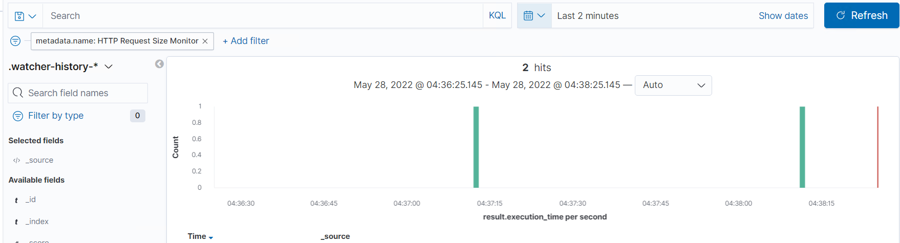

# Blue Team: Summary of Operations

## Table of Contents
- Network Topology
- Description of Targets
- Monitoring the Targets
- Patterns of Traffic & Behavior
- Suggestions for Going Further

### Network Topology

The following machines were identified on the network:
- Hyper V Azure Host Machine
  - **Operating System**: Windows 10 Pro
  - **Purpose**: Hyper V host of Linux machines
  - **IP Address**: 192.168.1.1
- Kali
  - **Operating System**: Kali Linux
  - **Purpose**: Attack machine
  - **IP Address**: 192.168.1.90
- ELK Server
  - **Operating System**: Linux Ubuntu
  - **Purpose**: Process log data (Metricbeat and Filebeat) from Capstone and present it in readable form using Kibana.
  - **IP Address**: 192.168.1.100
- Capstone
  - **Operating System**: Linux Ubuntu
  - **Purpose**: Capture log data and forward them to the ELK Server.
  - **IP Address**: 192.168.1.105
- Target 1
  - **Operating System**: Linux
  - **Purpose**: Target #1 - Vulnerable Wordpress server to be attacked
  - **IP Address**: 192.168.1.110
- Target 2
  - **Operating System**: Linux
  - **Purpose**: Target #2 - Vulnerable Wordpress server to be attacked
  - **IP Address**: 192.168.1.110

### Description of Targets

The target of this attack was: `Target 1 - 192.168.1.110`.

Target 1 is an Apache web server and has SSH enabled, so ports 80 and 22 are possible ports of entry for attackers. As such, the following alerts have been implemented:

### Monitoring the Targets

Traffic to these services should be carefully monitored. To this end, we have implemented the alerts below:

#### Excessive HTTP Responses

Excessive HTTP Responses is implemented as follows:
  - **Metric**: Packetbeat: http.response.status_code > 400
  - **Threshold**: Reports the top 5 sources of HTTP  response codes greater than 400 over the past five minutes.
    - WHEN count() GROUPED OVER top 5 'http.response.status_code' IS ABOVE 400 FOR THE LAST 5 minutes
  - **Vulnerability Mitigated**: Primary used to detect brute force attacks on the website.
  - **Reliability**: High reliability as there is something happening with your website if you're getting significantly higher hits than your usual traffic, even if you're not under attack.

#### HTTP Request Size Monitor
HTTP Request Size Monitor is implemented as follows:
  - **Metric**: Packetbeat: http.request.bytes
  - **Threshold**: The sum of the requested bytes over all documents is greater than 3,500 for the past minute.
    - WHEN sum() of http.request.bytes OVER all documents IS ABOVE 3500 FOR THE LAST 1 minute
  - **Vulnerability Mitigated**: Primary used to detect brute force attacks anywhere on the network.
  - **Reliability**: Low reliability as there were many instances of this alert being triggered when I wasn't using any of the VM's in the network. As can be seen by the screen shot below, with the Windows VM running for only 2 minutes and no other VM's being used, there are already two alerts for this watcher item.
  

#### CPU Usage Monitor
CPU Usage Monitor is implemented as follows:
  - **Metric**: Metricbeat: system.process.cpu.total.pct
  - **Threshold**: The maximum cpu total percentage os over 0.5 (50%) in 5 minutes
    - WHEN max() OF system.process.cpu.total.pct OVER all documents IS ABOVE 0.5 FOR THE LAST 5 minutes
  - **Vulnerability Mitigated**: Brute force (run by an attacker using the target network), virus or malware.
  - **Reliability**: High reliability. Whilst there could potentially be many false positives from this alert, they would most likely be when the system admin is running processes on the server and they would be expecting to see them. I would expect the unanticipated triggers of this alert to rarely be a false positive.

### Suggestions for Going Further

The logs and alerts generated during the assessment suggest that this network is susceptible to several active threats, identified by the alerts above. In addition to watching for occurrences of such threats, the network should be hardened against them. The Blue Team suggests that IT implement the fixes below to protect the network:
- Website brute force
  - **Patch**: Install `fail2ban` with `sudo apt-get install fail2ban`
  - **Why It Works**: Automatically blocks IP addresses that have too many connection failures.
- Network brute force
  - **Patch**: Install `Firewalld` with `sudo apt -y install firewalld`
  - **Why It Works**: `Firewalld` can be configured so that you have no exposed ports and has the ability to drop all traffic from a certain domain through it's panic mode.
- Virus / malware
  - **Patch**: Install `Bitdefender Endpoint Security Tools` by downloading the package from their website after purchasing.
  - **Why It Works**: `Bitdefender Endpoint Security Tools` scans the system for viruses every day and has real-time machine learning malware scanning and protection.
