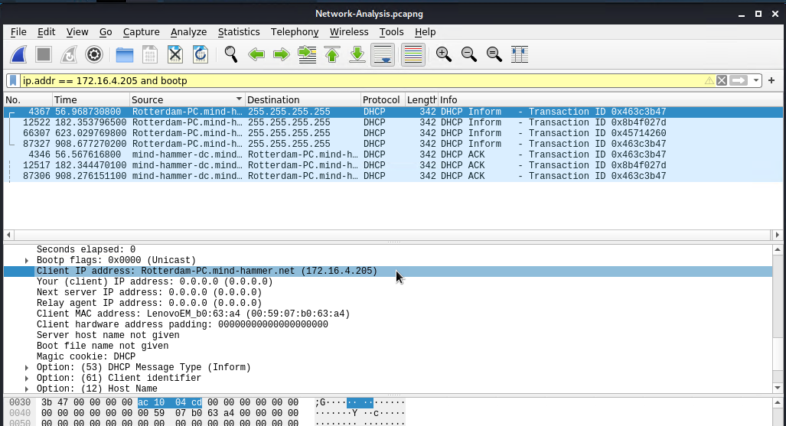

# Network Forensic Analysis Report

## Time Thieves 
You must inspect your traffic capture to answer the following questions:

1. What is the domain name of the users' custom site? `frank-n-ted.com`

2. What is the IP address of the Domain Controller (DC) of the AD network? `10.6.12.12`
3. What is the name of the malware downloaded to the 10.6.12.203 machine? `june11.dll`

4. Upload the file to [VirusTotal.com](https://www.virustotal.com/gui/). 

5. What kind of malware is this classified as? `Trojan`

---

## Vulnerable Windows Machine

1. Find the following information about the infected Windows machine:
    - Host name: Rotterdam-PC.mind-hammer.net
    - IP address: 172.16.4.205
    - MAC address: 00:59:07:b0:63:a4

2. What is the username of the Windows user whose computer is infected? `rotterdam-pc$`

3. What are the IP addresses used in the actual infection traffic?
    - Victim: 172.16.4.205
    - Source: 31.7.62.214

4. As a bonus, retrieve the desktop background of the Windows host.

---

## Illegal Downloads

1. Find the following information about the machine with IP address `10.0.0.201`:
    - MAC address: `00:16:17:18:66:c8`
    - Windows username: `elmer.blanco`

      
    - Computer OS: `Windows 10`

      

2. Which torrent file did the user download?
    - `Betty_Boop_Rythm_on_the_Reservation.avi.torrent`

      
