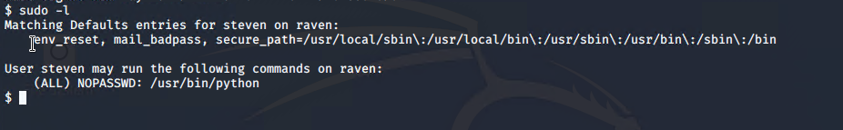

# Red Team: Summary of Operations

## Table of Contents
- Exposed Services
- Critical Vulnerabilities
- Exploitation

### Exposed Services

Nmap scan results for the target machine reveal the below services and OS details:

```bash
$ nmap -sV 192.168.1.110
```


OS: Linux

This scan identifies the services below as potential points of entry:
| Port    | Service    | Version    |
| --- | --- | --- |
|  22   | ssh    | OpenSSH 6.7p1 |
|  80   | http    | Apache httpd 2.4.10 (debian)|
|  111   | rpcbind    | 2-4 |
|  139   | netbios-ssn    | Samba smbd 3.X - 4.X |
|  445   | netbios-ssn    | Samba smbd 3.X - 4.X |

The following vulnerabilities were identified on target 1:
| Vulnerability    | CWE / CVE    |
| --- | --- |
| Sensitive Data Exposure    | CWE-200    |
| Wordpress Enumeration    | CWE-284    |
| Exposed ports    | CWE-200    |
| Weak passwords    | CWE-521    |
| Unprotected wp-config.php file    | CWE-284    |
| Privilege escalation    | CVE-2022-1356    |


### Exploitation

The Red Team was able to peneatrate `Target 1` and retrieve the following confidential data:
 #### Flag 1
  - `flag1.txt`: b9bbcb33e11b80be759c4e844862482d
  - We found flag 1 using two different methods, it was the same flag in the same location, not a duplicate.
    - **Exploit Used**
        - Sensitive Data Exposure 
    - **Method**
      - Navigate to `http://192.168.1.110/service.html`, press ctrl+u or right click on the webpage and select `view page source`.
      
    - **Exploits Used**
        - WordPress Enumeration
        - Exposed ports
        - Weak passwords
    - **Method**
      - A WPScan revealed the existence of two user accounts, steven and michael - `wpscan --url http://192.168.1.110/wordpress/ --enumerate u`.
      - The nmap scan revealed that port 22 was exposed, so we decided to attempt to ssh first - `nmap -sV 192.168.1.110`.
      - Before attempting a brute force of passwords, we decided to try and guess the password to the michael account. The password was so weak, that we guessed it correctly on the first attempt.
      
      
      
      

#### Flag 2
  - `flag2.txt`: fc3fd58dcdad9ab23faca6e9a36e581c
  - no additional exploits were required to find flag 2 after we found flag 1 for the second time.
    - **Method**
      - When traversing through some of the more interesting looking directories, we discovered flag2.txt
      

#### Flag 3
  - `flag3.txt`: afc01ab56b50591e7dccf93122770cd2
    - **Exploits Used**
      - Unprotected wp-config.php file

    - **Method**
      - Further investigation of the directories, we found `wp-config.php`. This was an interesting find as the permissions of the file meant that anyone could read it. This file contains the username and password for the WordPress MySQL database stored in plain text. It is not possible to encrypt the username or password, so securing the file by other means is of utmost importance.
      - Loging into the MySQL database, we found flag 3 from `select * from wp_posts;`
      
      

#### Flag 4
  - `flag4.txt`: 715dea6c055b9fe3337544932f2941ce
  - We found flag 4 in two different locations. It had the same value in both locations. We found the first flag 4 at the same time as flag 3 from the MySQL database as described above.
    
    - **Exploits Used**
      - Weak password
      - Privilege escalation

    - **Method**
      - Using `select * from wp_users;` we found steven's password hash. It was another weak password and we were able to crack it rather quickly using John the Ripper using the command `john wp_hashes`.
      - Running `sudo -l` we found that steven had sudo access in `/usr/bin/python`. Using the command `sudo python -c 'import pty;pty.spawn("/bin/bash")'` we were able to utilise a sudo exploit and gain a root shell. We then found flag 4 in the root directory.
      
      
      
      
      
      
      


