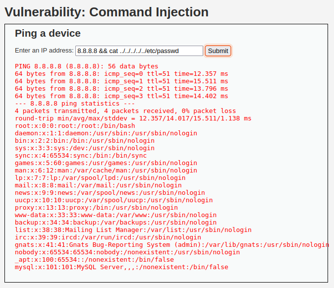
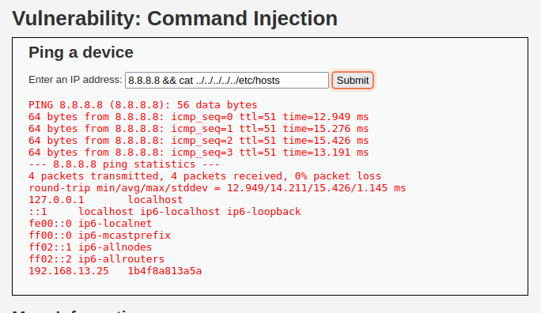
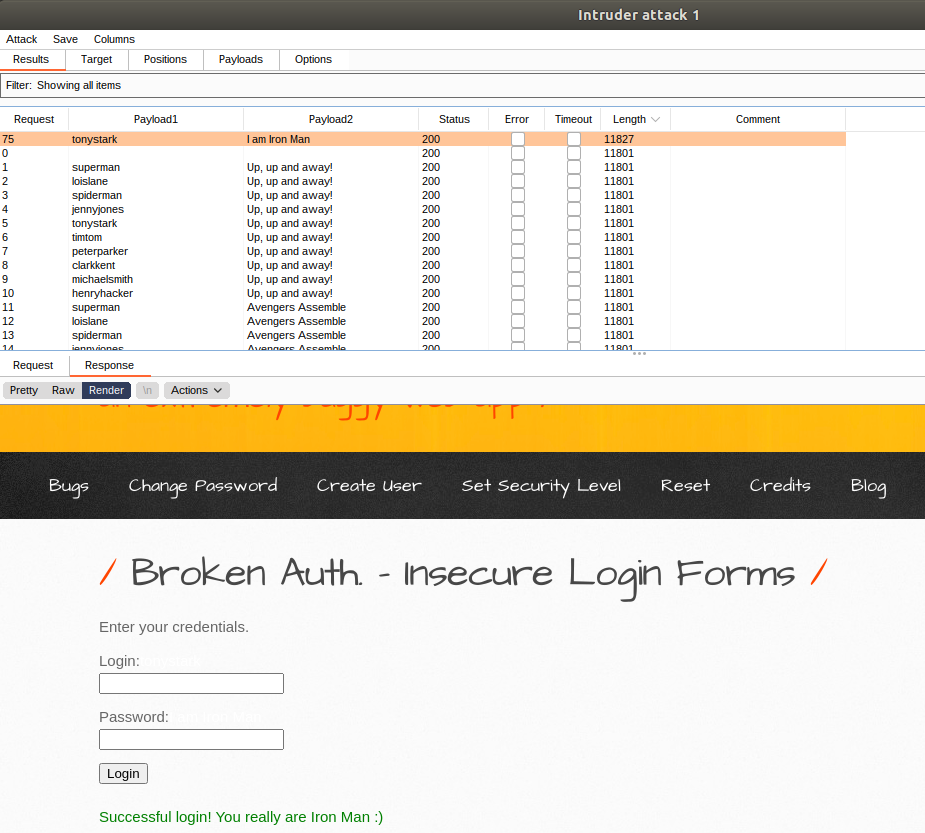
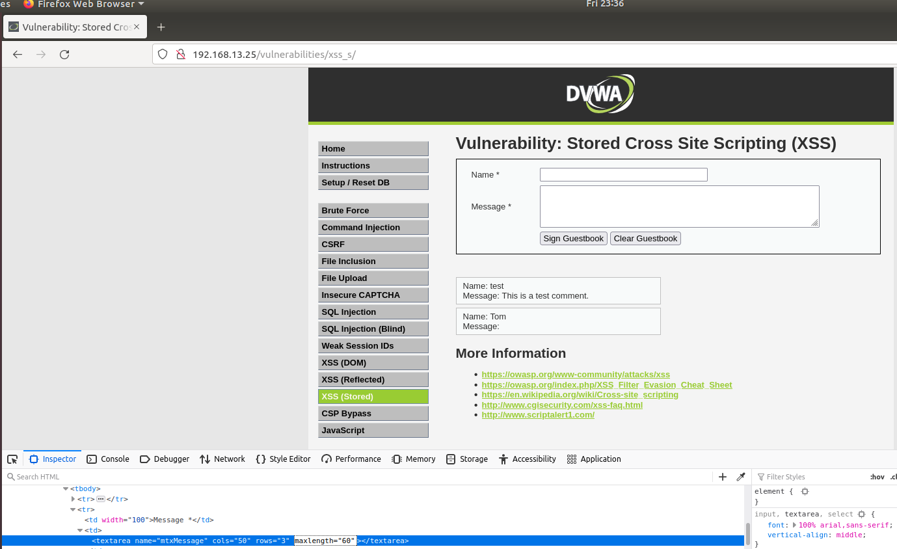
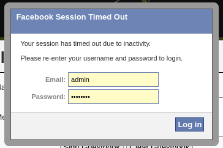
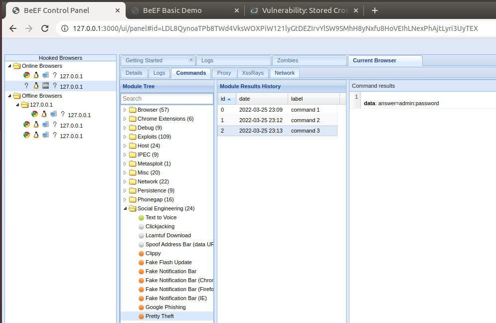
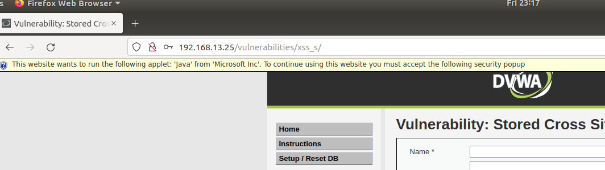
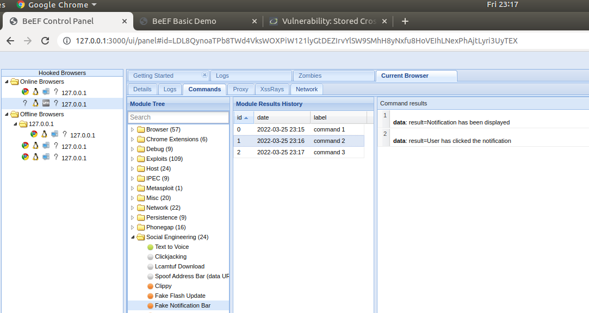
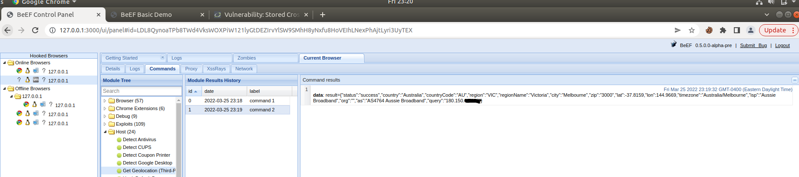

# Unit 15 Homework - Web-Vulnerabilities and Hardening

## Web Apllication #1
### Command Injection
#### Exploit
Using the dwva, use command injection to view the passwd and hosts file in /etc

#### Mitigation
The best way to avoid this vulnerability is to not allow the execution of OS commands. However, when this is not possible, properly configured server side input validation will deny access to this vulnerability.

## Web Apllication #2
### Brute Force

#### Investigation
Use the web application tool **Burp Suite**, specifically the **Burp Suite Intruder** feature, to determine if any of the administrator accounts are vulnerable to a brute force attack on this web application. 

`user: tonystark`
`Password: "I am Iron Man"`

#### Mitigation
There are a number of mitigation methods to prevent brute force attacks, depending on what type of asset you are trying to defend. Two common and very effective methods are multi-factor authentication, and to lock the account after x number of failed attempts. Another possible method to prevent a brute force attack without locking the account to it's rightful owner is to prevent further attempts based on an IP address after x failed attempts, however this could easily be bypassed if the attacker is using a botnet with many ip addresses for it's bots.

## Web Application #3
### Where's the BeEF?

#### Exploit
 You are tasked with using a stored XSS attack to inject a BeEF hook into Replicants' main website.

   - Task details:
     - The page you will test is the Replicants Stored XSS application which was used the first day of this unit: `http://192.168.13.25/vulnerabilities/xss_s/`
     - The BeEF hook, which was returned after running the `sudo beef` command was: `http://127.0.0.1:3000/hook.js`
     - The payload to inject with this BeEF hook is: ``

   -  When you attempt to inject this payload,  you will encounter a client-side limitation that will not allow you to enter the whole payload. You will need to find away around this limitation.    
      
      
    
   - Once you are able to hook into Replicants website, attempt a couple BeEF exploits. Some that work well include:
     
     - Social Engineering >> Pretty Theft    
       

   

     
     - Social Engineering >> Fake Notification Bar
     
     
     
     - Host >> Get Geolocation (Third Party)
     
     
#### Mitigation
To mitigate against xss attacks, all user input should be cleansed through the use of escaping, filtering and validation. This can be done on the client side, and **should always** be done on the server side as client side strategies won't be effective against the use of a terminal window to access your website using commands such as cURL.