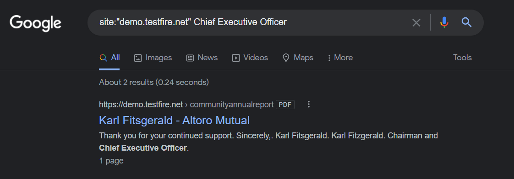
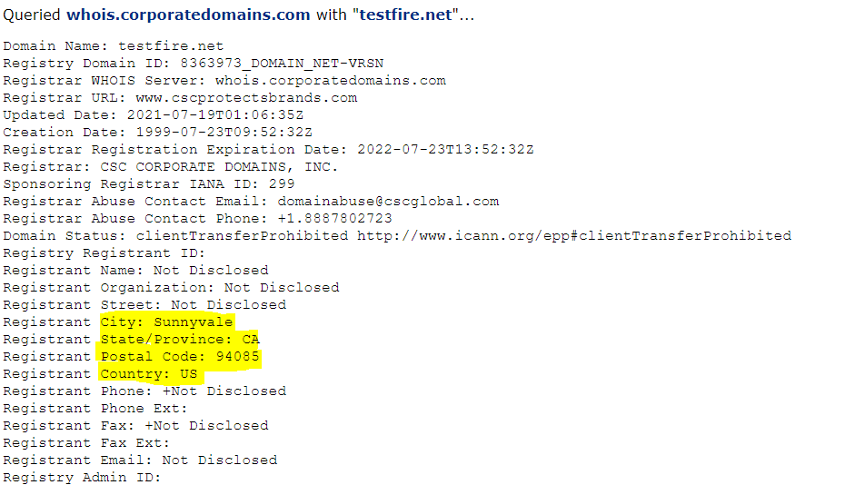
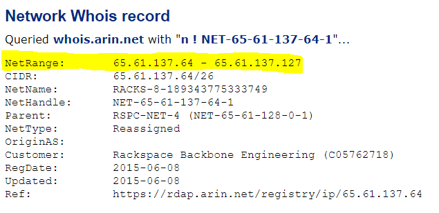
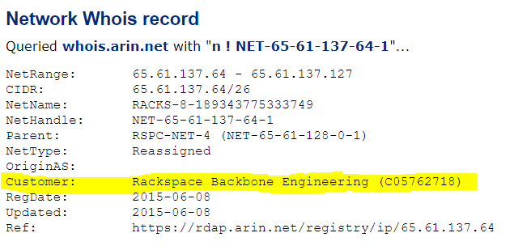
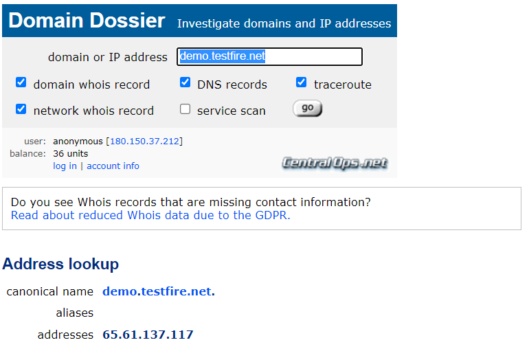
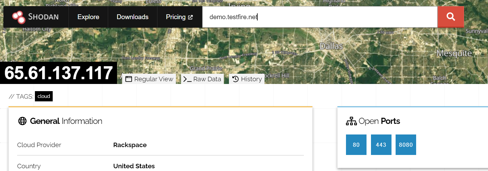
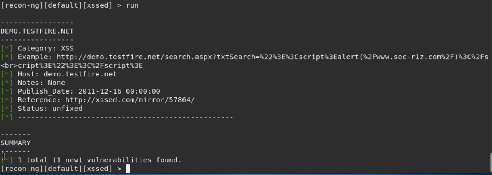
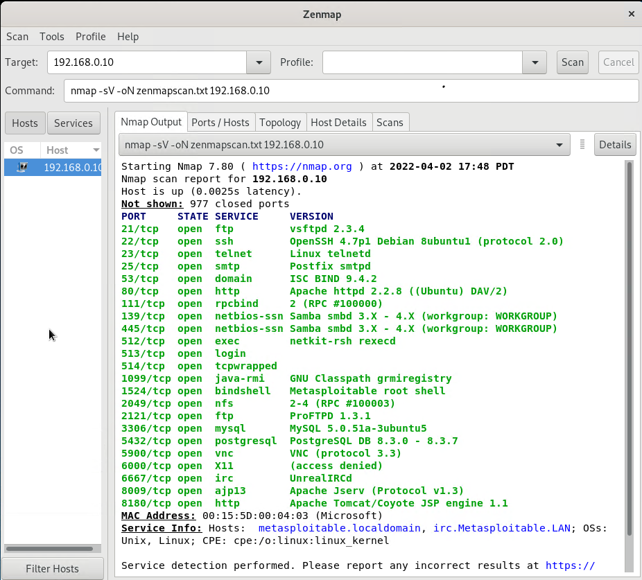
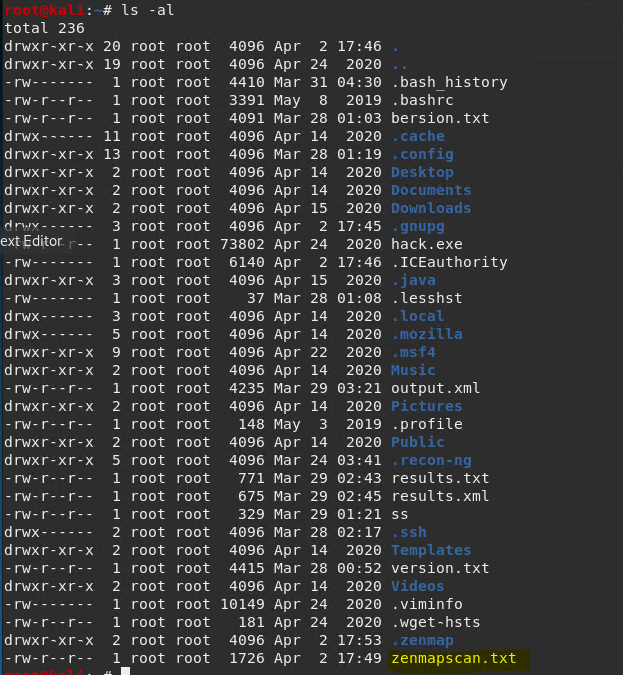
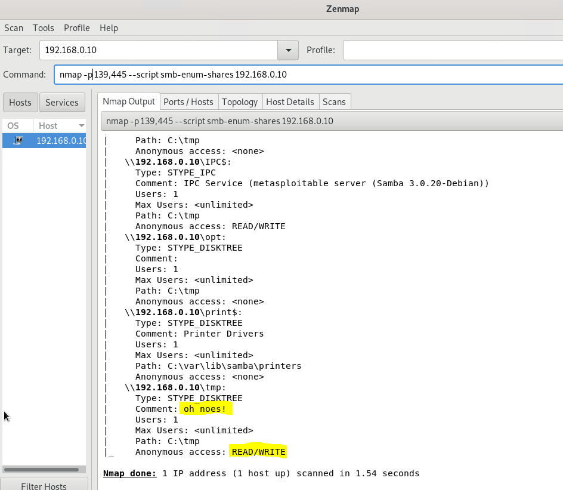

## Week 16 Homework Submission File: Penetration Testing 1

#### Step 1: Google Dorking

- Using Google, can you identify who the Chief Executive Officer of Altoro Mutual is: `Karl Fitsgerald`

- How can this information be helpful to an attacker: `Being able to get personal information easily by GooGle Dorking, can facilitate phishing scams targeted at specific people (usually high level management).`

#### Step 2: DNS and Domain Discovery

Enter the IP address for `demo.testfire.net` into Domain Dossier and answer the following questions based on the results:

  1. Where is the company located: Sunnyvale 94085, California. USA
   

  2. What is the NetRange IP address: 65.61.137.64 - 65.61.137.127
  

  3. What is the company they use to store their infrastructure: Rackspace Backbone Engineering
  

  4. What is the IP address of the DNS server: 65.61.137.117
  

#### Step 3: Shodan

- `Shodan found that ports 80, 443 and 8080 were all open`
 

#### Step 4: Recon-ng

- Install the Recon module `xssed`. 
- Set the source to `demo.testfire.net`. 
- Run the module. 
  

Is Altoro Mutual vulnerable to XSS: `Yes, Altoro is vulnerable to XSS`

### Step 5: Zenmap

Your client has asked that you help identify any vulnerabilities with their file-sharing server. Using the Metasploitable machine to act as your client's server, complete the following:

- Command for Zenmap to run a service scan against the Metasploitable machine: `nmap -sV -oN zenmapscan.txt 192.168.0.10`

- Bonus command to output results into a new text file named `zenmapscan.txt`:

- Zenmap vulnerability script command: `nmap -p 139,445 --script smb-enum-shares 192.168.0.10`
  - -p 139,445: `Tells nmap what ports to run the scan on.`
  - --script: `Option used to tell nmap to run a pre-defined script.`
  - smb-enum-shares: `name of the script nmap will run.`
  - 192.168.0.10: `IP address of host that will be scanned.`
 

- Once you have identified this vulnerability, answer the following questions for your client:
  1. What is the vulnerability: `nmap found an open share service with read/write privileges available with anonymous access for an attacker to drop a Trojan or to infect a file that is already there.`

  2. Why is it dangerous: `It is dangerous because it gives a hacker an opportunity to spread malware and potentially take control of the system. The access is anonymous, so it would be easy to infect the system without being identified - it's low risk.`

  3. What mitigation strategies can you recommendations for the client to protect their server: `To mitigate this vulnerability, I would recommend not exposing these ports to the public internet. Placing them behind a properly configured firewall would enable them to continue to be used by those authorised to do so, and make it harder for unauthorised access.`

---
© 2020 Trilogy Education Services, a 2U, Inc. brand. All Rights Reserved.  

