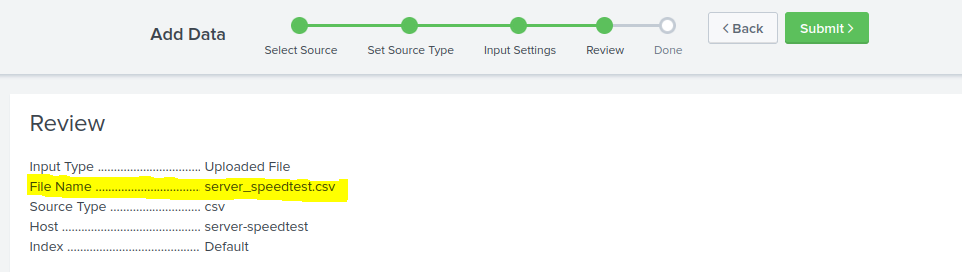
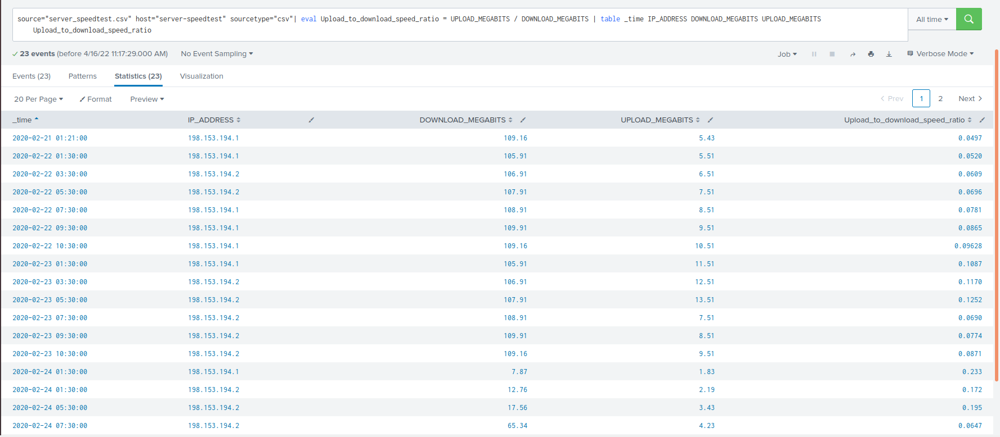
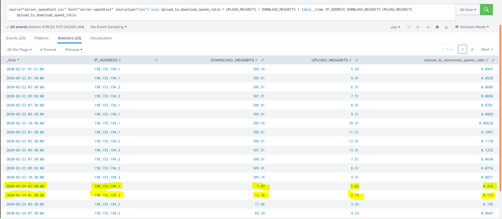
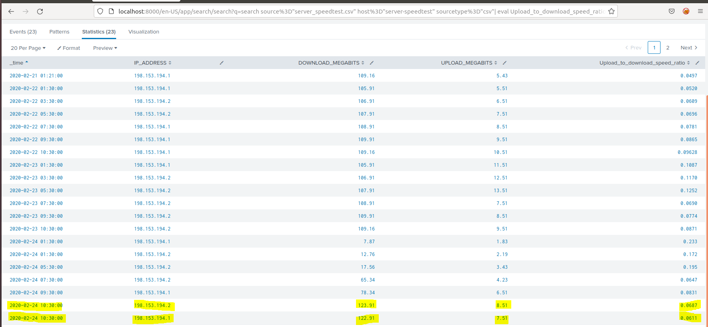
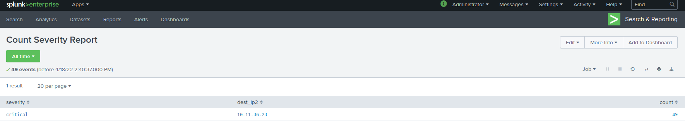
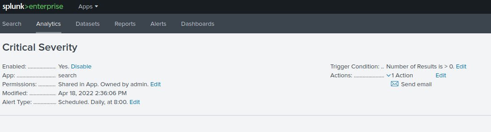
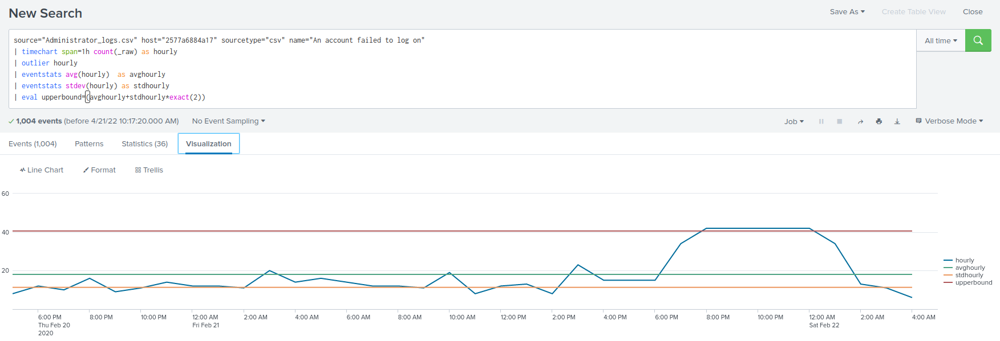
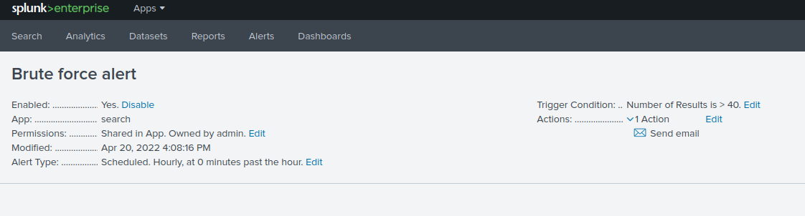
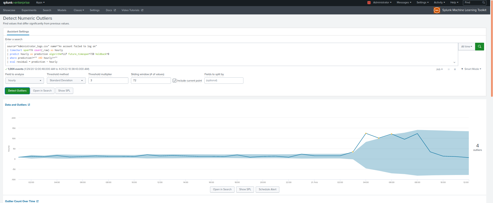
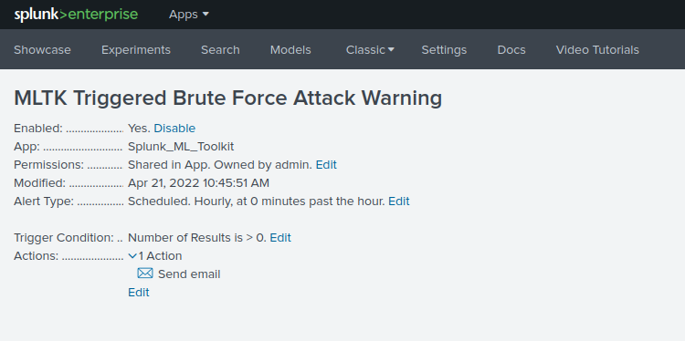

## Unit 18 Homework: Lets go Splunking!

### Scenario

You have just been hired as an SOC Analyst by Vandalay Industries, an importing and exporting company.
 
- Vandalay Industries uses Splunk for their security monitoring and have been experiencing a variety of security issues against their online systems over the past few months. 
 
- You are tasked with developing searches, custom reports and alerts to monitor Vandalay's security environment in order to protect them from future attacks.

### System Requirements 

You will be using the Splunk app located in the Ubuntu VM.

### Your Objective 

Utilize your Splunk skills to design a powerful monitoring solution to protect Vandaly from security attacks.

After you complete the assignment you are asked to provide the following:

- Screen shots where indicated.
- Custom report results where indicated.

### Topics Covered in This Assignment

- Researching and adding new apps
- Installing new apps
- Uploading files
- Splunk searching
- Using fields
- Custom reports
- Custom alerts

Let's get started!

---

## Vandalay Industries Monitoring Activity Instructions

### Step 1: The Need for Speed 

**Background**: As the worldwide leader of importing and exporting, Vandalay Industries has been the target of many adversaries attempting to disrupt their online business. Recently, Vandaly has been experiencing DDOS attacks against their web servers.

Not only were web servers taken offline by a DDOS attack, but upload and download speed were also significantly impacted after the outage. Your networking team provided results of a network speed run around the time of the latest DDOS attack.

**Task:** Create a report to determine the impact that the DDOS attack had on download and upload speed. Additionally, create an additional field to calculate the ratio of the upload speed to the download speed.

1.  Upload the following file of the system speeds around the time of the attack.
     [Speed Test File](Resources/server_speedtest.csv)
     

2. Using the `eval` command, create a field called `ratio` that shows the ratio between the upload and download speeds.
   - `| eval Upload_to_download_speed_ratio = UPLOAD_MEGABITS / DOWNLOAD_MEGABITS`
   
      
3. Create a report using the Splunk's `table` command to display the following fields in a statistics report:
    - `_time`
    - `IP_ADDRESS`
    - `DOWNLOAD_MEGABITS`
    - `UPLOAD_MEGABITS`
    - `ratio`
  
   

4. Answer the following questions:

    - Based on the report created, what is the approximate date and time of the attack? `1:30 on 24th Feb, 2020`
  
    - How long did it take your systems to recover? `Approximately 9 hours at 10:30`
    

### Step 2: Are We Vulnerable? 

**Background:**  Due to the frequency of attacks, your manager needs to be sure that sensitive customer data on their servers is not vulnerable. Since Vandalay uses Nessus vulnerability scanners, you have pulled the last 24 hours of scans to see if there are any critical vulnerabilities.

  - For more information on Nessus, read the following link: https://www.tenable.com/products/nessus

**Task:** Create a report determining how many critical vulnerabilities exist on the customer data server. Then, build an alert to notify your team if a critical vulnerability reappears on this server.

1. Upload the following file from the Nessus vulnerability scan.
   - [Nessus Scan Results](Resources/nessus_logs.csv)

2. Create a report that shows the `count` of critical vulnerabilities from the customer database server.
   - The database server IP is `10.11.36.23`.
   - The field that identifies the level of vulnerabilities is `severity`.
   
      
3. Build an alert that monitors every day to see if this server has any critical vulnerabilities. If a vulnerability exists, have an alert emailed to `soc@vandalay.com`.
   

### Step 3: Drawing the (base)line

**Background:**  A Vandaly server is also experiencing brute force attacks into their administrator account. Management would like you to set up monitoring to notify the SOC team if a brute force attack occurs again.

**Task:** Analyze administrator logs that document a brute force attack. Then, create a baseline of the ordinary amount of administrator bad logins and determine a threshold to indicate if a brute force attack is occurring.

1. Upload the administrator login logs.
   - [Admin Logins](Resources/Administrator_logs.csv)

2. When did the brute force attack occur?
 `The attack occurred between 20:00 on 21st Feb, 2020 until 00:59: on the 22nd Feb, 2020. When a failed login occurs at 17:10, it is listed in the report under the 17:00 time group, so attacks occurring in the 00:00 group could have happen as late as 00:59.`

      
3. Determine a baseline of normal activity and a threshold that would alert if a brute force attack is occurring. `After removing outliers using "| Outliers hourly" splunk calculated the average failed logins as 18 and the standard deviation as 11.3. Setting a baseline of normal activity of plus two standard deviations away from the mean results in a baseline of 40.`
 

4. Design an alert to check the threshold every hour and email the SOC team at SOC@vandalay.com if triggered. 
   

 
### Utilising machine learning in Splunk
   Alerts based on a hardcoded trigger will ultimately result in higher and higher rates of false positives as the business grows until re-calculated, implementing a dynamic trigger should significantly reduce the occurrence of false positives whilst still providing you with the necessary alerts as required with a reduced requirement of human input. 
    A better alert utilising MLTK in Splunk would be
Identifying outliers:

 
MLTK triggered alert:

 

© 2020 Trilogy Education Services, a 2U, Inc. brand. All Rights Reserved.
