## Unit 19 Homework: Protecting VSI from Future Attacks

### Scenario

In the previous class,  you set up your SOC and monitored attacks from JobeCorp. Now, you will need to design mitigation strategies to protect VSI from future attacks. 

You are tasked with using your findings from the Master of SOC activity to answer questions about mitigation strategies.

### System Requirements 

You will be using the Splunk app located in the Ubuntu VM.

### Logs

Use the same log files you used during the Master of SOC activity:

- [Windows Logs](resources/windows_server_logs.csv)
- [Windows Attack Logs](resources/windows_server_attack_logs.csv)
- [Apache Webserver Logs](resources/apache_logs.txt	)
- [Apache Webserver Attack Logs](resources/apache_attack_logs.txt	)

---

### Part 1: Windows Server Attack

Note: This is a public-facing windows server that VSI employees access.
 
#### Question 1
- Several users were impacted during the attack on March 25th.
- Based on the attack signatures, what mitigations would you recommend to protect each user account? Provide global mitigations that the whole company can use and individual mitigations that are specific to each user.

   - Usersa, user_k and user_j all had unusually high activity during the attack, with each one experiencing a different form of attack. User_k_ had the highest focus with 2,021 attempts to reset their password, user_a's account was locked 1,694 times and user_j's account was logged into 302 times.
 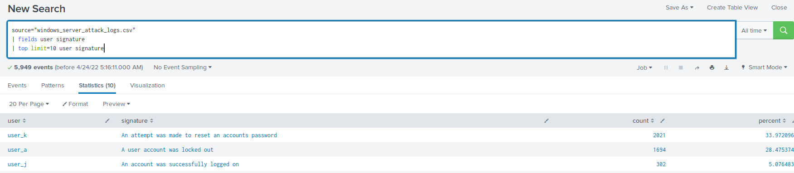  
    - It appears that the hackers were attempting to brute force access to user_a, and it appears that they succeeded as the logs also show that the account was logged into 11 times during the same time as the attack and a few more times in the early hours of the morning following the initial attack. 
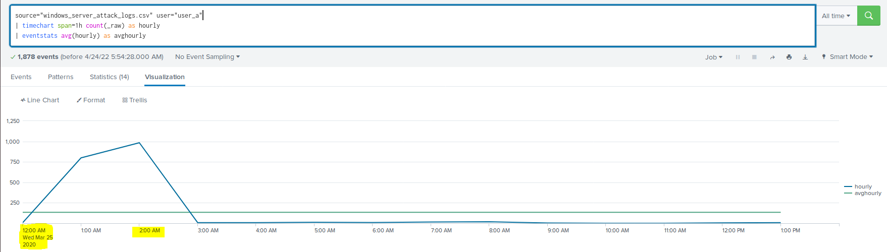  
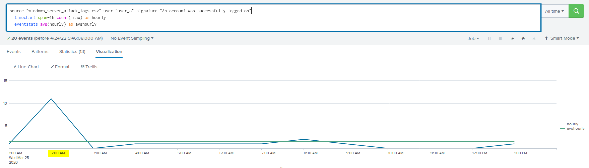  
    - To mitigate this, user_a needs to create a stronger password that is not feasible to brute force.  
    - User_c appears to be the victim of a phishing attack as their account was logged into 302 times and there were no logs indicating the account was locked or even attempted to be accessed with incorrect credentials. Alternatively, user_c could be secretly working for Jobecorp, but this is outside the scope of this investigation.  
    - To mitigate against this, user_c needs to learn how to verify the authenticity of the sender of emails, the links which they contain and the websites which they send the user to. Asking themselves a simple question of "would xyz send me an email asking me this?" could assist them in avoiding future phishing attacks.
      
    - For an unknown reason, the attackers didn't try to brute force their way into user_k's account, maybe they had information suggesting that they use long passwords. This resulted in the attackers attempting to reset user_k's password instead. It appears that they failed, as although there was one successfully logon during the attack, the attackers continued to attempt to reset the password on the account after this one successful logon.
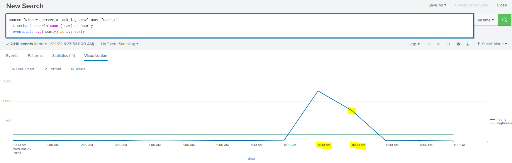 
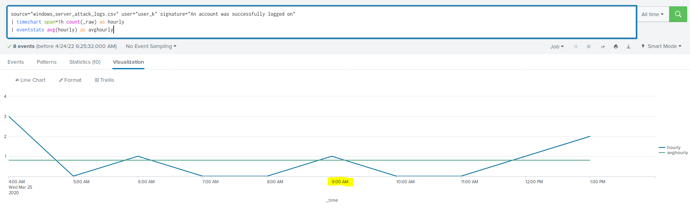  

    - Some potential global mitigation's for these attacks include:
      - Multi-factor authentication (MFA) would prevent the brute force attacks and the phishing attack. Attackers are starting to find ways to circumvent mfa using phishing attacks and MitM attacks, to add additional security, limiting account logon to specific ip addresses would greatly improve the level of security.
      - To mitigate against the resetting of a password attack, they could limit the number of allowed reset attempts per hour to five - Reviewing the data per hour by user shows the maximum reset requests by one user was four, and this only occurred on two occasions. Setting five as the limit should not cause any issues for their users. This was calculated using the normal data from "windows_server_logs.csv".

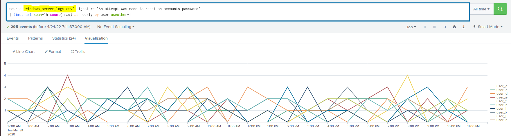

 
#### Question 2
- VSI has insider information that JobeCorp attempted to target users by sending "Bad Logins" to lock out every user.
- What sort of mitigation could you use to protect against this?
  - There are two techniques which I would recommend to mitigate this type of attack:
    1. The use of reCAPTCHA to prevent an automated tool sending continuous login attempts. These work by requiring a user to solve a simple math question, entering a random and partially obscured code or selecting a certain picture from a group of random pictures.
    2. A more complicated solution would be to apply progressive delays on unsuccessful login attempts. Each additional unsuccessful login attempt will result in a longer delay before another attempt to login is allowed.
  

### Part 2: Apache Webserver Attack:

#### Question 1
- Based on the geographic map, recommend a firewall rule that the networking team should implement.
- Provide a "plain english" description of the rule.
  - `Block all incoming HTTP traffic where the source IP comes from the country of Ukraine.`
- Provide a screen shot of the geographic map that justifies why you created this rule.  
  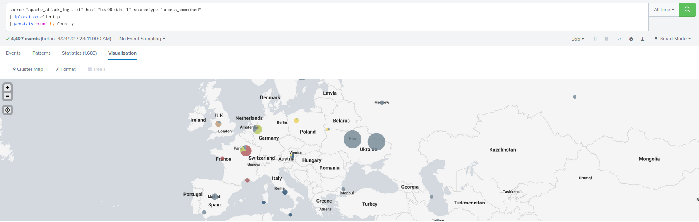
  
#### Question 2

- VSI has insider information that JobeCorp will launch the same webserver attack but use a different IP each time in order to avoid being stopped by the rule you just created.

- What other rules can you create to protect VSI from attacks against your webserver?
  - Conceive of two more rules in "plain english". 
    - Rule 1: `Block all incoming HTTP traffic where the byte size = 65748.`
      - As identified in the charts below, normal traffic where the byte size = 65748 is less than 1% of total traffic (avg hits where bytes = 65748 is approximately 1 verses an average of approximately 118 where bytes does not equal 65748). 
      data-bytes-equal-to-65748.PNG)  
      data-bytes-not-equal-to-65748.PNG)  
      - Whilst not all attacks (first chart) had a byte size of 65748, the second wave of attacks appear to almost all have a byte size of 65748 (second chart).
      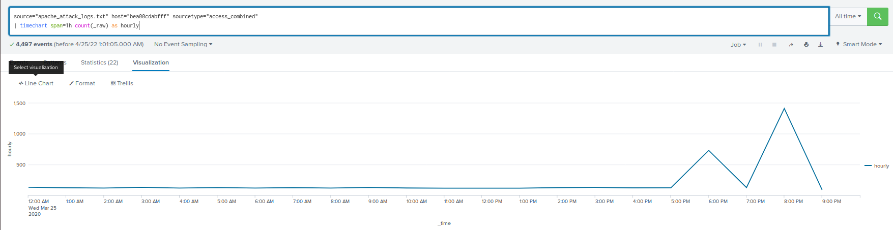
      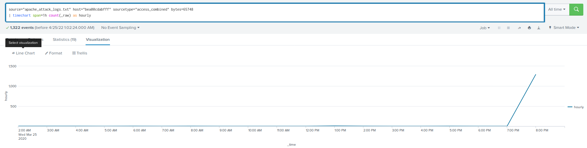

    - Rule 2: `Block all incoming HTTP traffic where the useragent="Mozilla/4.0 (compatible; MSIE 6.0; Windows NT 5.2; SV1; .NET CLR 2.0.50727987787; InfoPath.1)" OR useragent="Chef Client/10.18.2 (ruby-1.9.3-p327; ohai-6.16.0; x86_64-linux; +http://opscode.com)".`
    - The following two charts highlight that the whole traffic from the useragent's listed above are responsible for the attacks. The first shows all traffic, and the second only traffic by the two useragent's listed in the firewall rule.
    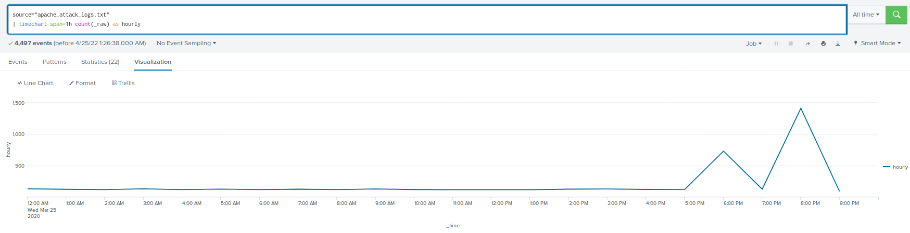
    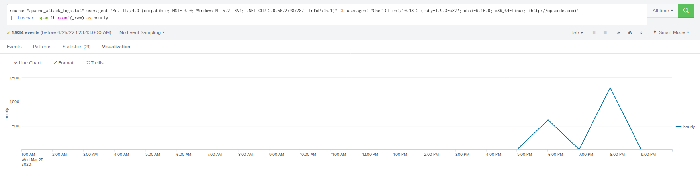

---

© 2020 Trilogy Education Services, a 2U, Inc. brand. All Rights Reserved.
