## Automated ELK Stack Deployment

The files in this repository were used to configure the network depicted below.

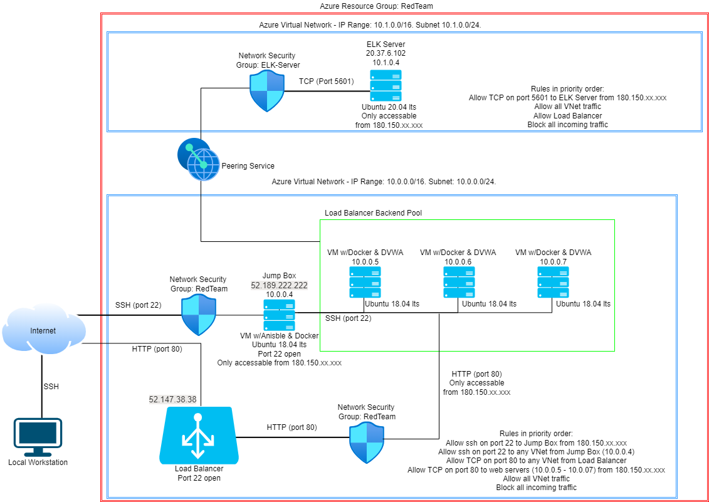

These files have been tested and used to generate a live ELK deployment on Azure. They can be used to either recreate the entire deployment pictured above. Alternatively, select portions of the playbook file may be used to install only certain pieces of it, such as Filebeat.

- [Filebeat playbook](Ansible/filebeat-playbook.yml)

This document contains the following details:
- Description of the Topologu
- Access Policies
- ELK Configuration
  - Beats in Use
  - Machines Being Monitored
- How to Use the Ansible Build

### Description of the Topology

The main purpose of this network is to expose a load-balanced and monitored instance of DVWA, the Damn Vulnerable Web Application.

Load balancing ensures that the application will be highly stable, in addition to restricting access to the network. 

- Load balancers protect the availability of your web servers by preventing bottlenecks. They achieve this by systematically distributing the incoming traffic over all available services as defined by their rules for distributing packet data. This network redundancy means that if one of your servers is down, need to perform maintenance or you need to upgrade your servers, the availability of your website isn't compromised.
- The main advantage of a jump box is that it provides a secure perimeter around IT resources. Providing admins with ease of access to these resources once they've connected to the jump box, they can easily maintain the entire network (or portion of the network that the jump box provides access to) from one machine using scripts (such as ansible) to update/upgrade/deploy/remove/uninstall/start/stop software and services on the network.
  More recently, security professionals have been moving away from jump boxes (servers) as they provide a single point of failure - that is, if an attacker can access the jump box, then they can easily move about within all of the resources connected to that jump box. This flaw was highlighted in the data breach experienced by the U.S Office of Personnel Management in 2015 when an attacker gained access to their jump server and subsequently had access to their entire network.
 
Integrating an ELK server allows users to easily monitor the vulnerable VMs for changes to the logs and system traffic.
- Using Filebeat, you can monitor log files or defined locations, it will then collect log events and forward this data to either Elasticsearch or Logstash for indexing.
- Metricbeat allows to collect a list of metrics (a metricset) for a specific service. The exact data collect will depend upon what type of service Metricbeat is monitoring. For example, when Metricbeat is monitoring a webserver, it will return data on unique hits, country source, ip address, source OS etc.

The configuration details of each machine may be found below.

|  Name        | Function   | IP Address  | Operating System  |
|--------------|------------|-------------|-------------------|
| Jump Box     |  Gateway   | 10.0.0.4 (52.189.222.222)    |  Linux            |
| Web 1        | Web Server | 10.0.0.5    |  Linux            |
| Web 2        | Web Server | 10.0.0.6    |  Linux            |
| Web 3        | Web Server | 10.0.0.7    |  Linux            |
| ELK-Server   | ELK-Server | 10.1.0.4 (20.37.6.102)   |  Linux            |

### Access Policies

The machines on the internal network are not exposed to the public Internet. 

Only the jump box machine can accept connections from the Internet. Access to this machine is only allowed from the following IP addresses:
- 180.150.xxx.xx

Machines within the network can only be accessed by the jump box.
- The ELK server is accessable by any machine within the VNet and from one external computer with an ip address of 180.150.xxx.xx

A summary of the access policies in place can be found in the table below.

|  **Name**  | **Publicly Accessible** |       **Allowed IP Addresses**      |
|:----------:|:-----------------------:|:-----------------------------------:|
| Jump Box   | Yes                     | 180.150.xxx.xx and all VNet IP addresses                     |
| Web 1      | No                      |  All VNet IP addresses               |
| Web 2      | No                      |  All VNet IP addresses                |
| Web 3      | No                      |  All VNet IP addresses               |
| ELK Server | Yes                     | 180.150.xxx.xx and all VNet IP addresses |
### Elk Configuration

Ansible was used to automate configuration of the ELK machine. No configuration was performed manually, which is advantageous because using ansible to configure the web servers means that you can configure 1 or 100 machines with the same amount of work. Additionally, once you have your ansible playbook correctly configured, then all future deployments using that playbook will be exactly the same and error free.

The playbook implements the following tasks:
- Increase the max mmap limit (set vm.max_map_count to 262144 in sysctl) to ensure that running Elasticsearch doesn't result in out of memory exceptions as the default system limits will most likely be too low.
- Download and install docker.io
- Download and install python3
- Download and install docker python package
- Download and launch a docker elk container
- Set docker service to always start on boot

The following screenshot displays the result of running `docker ps` after successfully configuring the ELK instance.
 
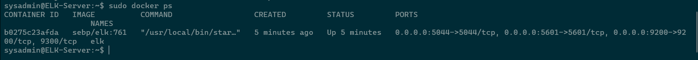

 ### Target Machines & Beats
This ELK server is configured to monitor the following machines:
- 10.0.0.5
- 10.0.0.6
- 10.0.0.7

We have installed the following Beats on these machines:
- Metricbeat
- Filebeat

These Beats allow us to collect the following information from each machine:
- Filebeat forwards all logs in /var/log (Linux) for each machine to logstash, then onto Kibana or directly to Kibana. Using Kibana, you can then view various dashboards in Kibana based on these logs, such as access logs or user logs.
- Metricbeat captures specific metricsets, reported via Kibana. These metrics can include information about activity on you web servers, such as source IP address, source geo location, OS type, browser, html response codes etc.

### Using the Playbook
In order to use the playbook, you will need to have an Ansible control node already configured. Assuming you have such a control node provisioned: 

SSH into the control node and follow the steps below:
- Make sure that `/etc/ansible/hosts` file is updated to correctly reflect your VNet configuration. Search for `[webservers],`and uncomment that line, then list the private IP addresses for your web servers under it. Create a new group `[elk]` and list your ELK server under that. Make sure you put `ansible_python_interpreter=/usr/bin/python3` after each ip address to prevent python errors.
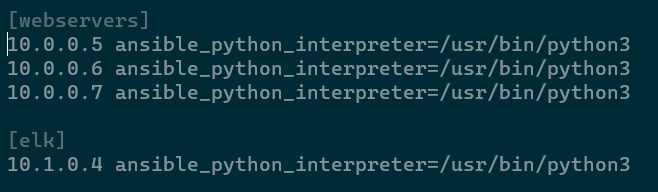
- Copy the configuration files for [filebeat](Ansible/filebeat-config.yml) and [metricbeat](Ansible/metricbeat-config.yml) to /etc/ansible/files/ on the control node. You might need to create this directory first.
- Update each configuration file to include the correct IP address and port for your ELK server in the `Elasticsearch output` (eg. 10.1.0.4:9200) section for both files and the `Kibana` section (eg. 10.1.0.4:5601) for the metricbeat configuration.
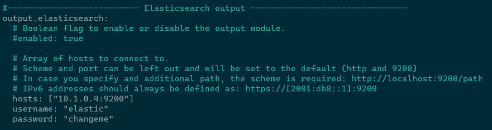
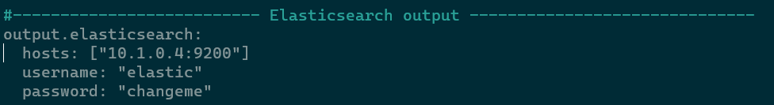
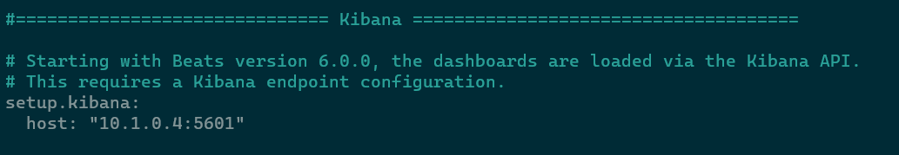
- Run the playbooks for [filebeat](Ansible/filebeat-playbook.yml) and [metricbeat](Ansible/metricbeat-playbook.yml) respectively, and navigate to your ELK server (eg. http://20.37.6.102:5601) to check that the installation worked as expected. The playbooks to install metricbeat and filebeat know which machines to install on based on the configuration (webservers) of the hosts file in /etc/ansible/ and the host setting in the playbook to match. The ELK server belongs to the `elk` group, not `webservers`, so metricbeat and filebeat won't be installed on it using these playbooks. 
- HTTP was used as opposed to HTTPS as this was a class project with no budget for installing a TLS certificate to provide HTTPS. I strongly recommend always using HTTPS instead of HTTP in commercial networks for the added security it provides.
  
### Kibana investigation
- Once everything was installed, I intentionally launched failed attempts to hack into my web server through use of a loop command `for i in {1..1000}; do ssh sysadmin@10.0.0.5; done` and `while true; do for i in {5..7}; do ssh sysadmin@10.0.0.$i; done; done` from my jump box server. The reason this failed is because the valid ssh key was generated within the ansible container on the jump box, not directly in the jump box itself. Inspection of the logs data revealed the long list of failed ssh login attempts. 
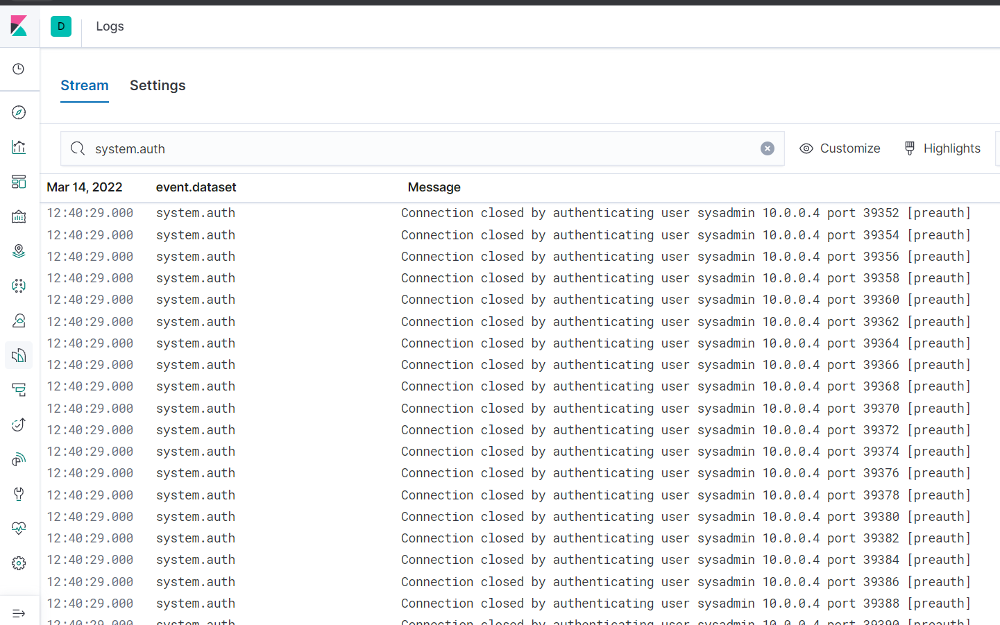
- Next I accessed one of my web servers and installed the apt `stress`. Upon running the command `sudo stress --cpu 1`, under metrics, I could see the cpu usage on that web server go to 100%. In real life, this could be an indicator of a potential breach attempt.
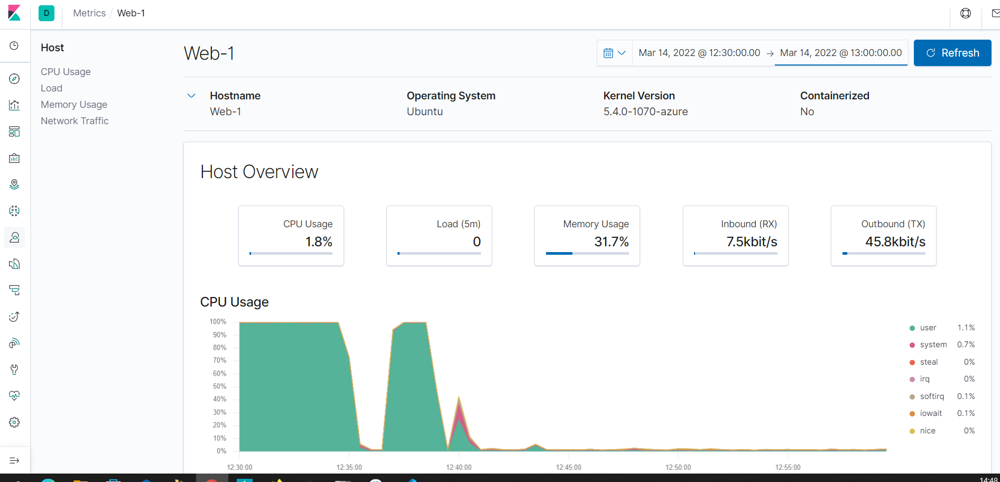
- To further test the metrics in Kibana, I looped a wget command for approximately 1 minute across all web servers via `while true; do for i in {5..7}; do wget -O /dev/null 10.0.0.$i; done; done`. Upon inspecting the metrics for each VM, I noticed an unusually large spike in outgoing data. This is another indicator of a potential attempt to breach. All three VM had a similar volume of traffic.
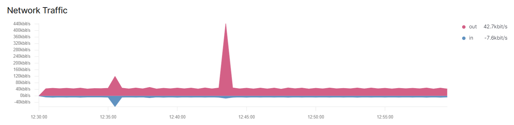

### Cryptography
During our unit on Cryptography, I was inspired to create an Excel Workbook [Cyphers.xlsm](/Cryptography/Cyphers.xlsm) to assist in deciphering Caesar and transposition cyphers due to issues with websites to process the task at hand. The workbook is a macro-enabled workbook and macro's need to be enabled for it to function correctly. It consists of three worksheets; `Caesar`, `Transposition` and `Brute_Force_Transposition`:

  - The Caesar worksheet will encode and decode a word or phrase, any non-alpha characters will not be encoded and will appear in the encoded message as they do in the decoded message. As there are six characters between `Z` and `a` in the ASCII character set, I have forced the original text (decoded message) to always be in lower case, even if uppercase characters are entered. If you have some coded text but you are unaware of the displacement used, this worksheet can brute force the decoding if it is Caesar encoded. If the original_text field (cell B2) is populated, then the process will encode it for you. If it is blank with text in cell B2, it will automatically attempt to decode it instead.
  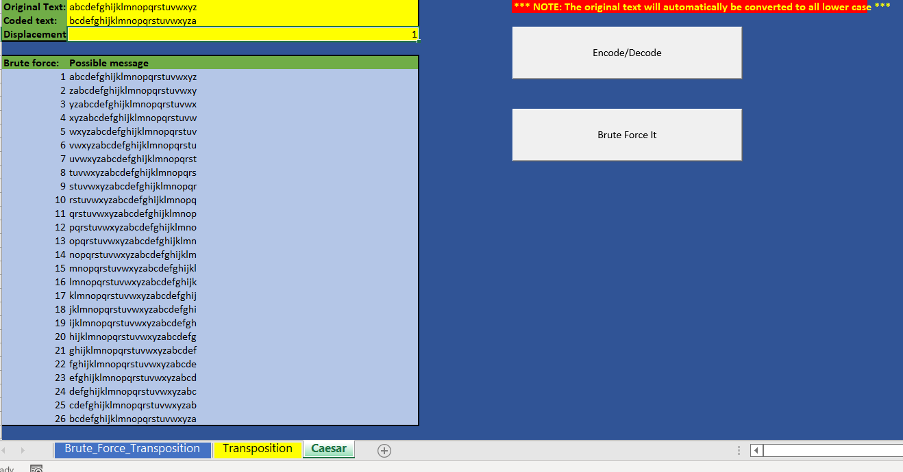
  - The transposition worksheet enables you to encode a word or phrase using a valid transposition key. The process automatically calculates the required key to go back to the previous word or phrase as not all keys work both ways. For example, `Neighbour` using a key of `643215` becomes `bgieNh  ruo` (the extra spaces are required when the number of letters in the word or phrase is not divisible by the key length). To convert `bgieNh  ruo` back to `Neighbour`,  you need to use the key `543261`
  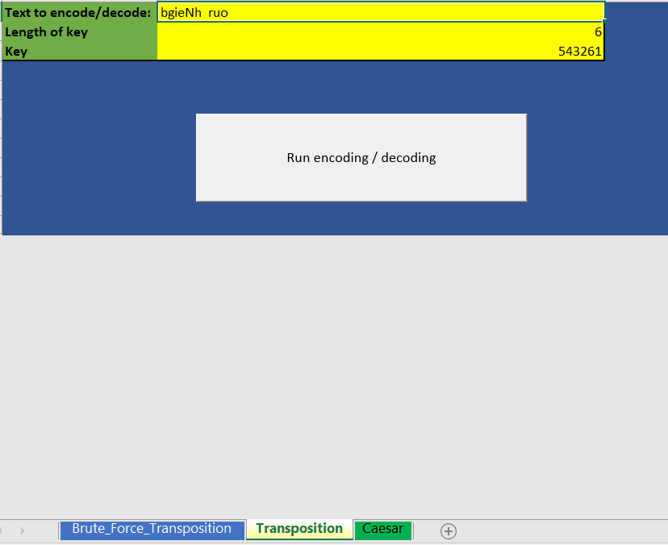
  - If you don't know the key to decode a transposition encoded word or phrase, the `Brute_Force_Transposition` worksheet might be able to solve it for you. It is limited to words that are in the current Excel default language (so you can change it if need be). In trying to balance success rate vs practical to attempt to brute force it, the dictionary provides superior speed with an eight number key encoded word or phrase taking just over three minutes to crack using my computer, but a word list takes many hours and results in many false matches. The major downside to the dictionary is when the word or phrase uses non-standard spelling, acronyms or other language spellings (such as color vs colour), all of which a word list can easily accommodate. The process will stop once it finds the number of matches that you have asked for (some words with short keys can result in multiple valid answers). You can see the progress in the status bar (bottom left hand corner in Excel) in terms of the percentage of attempts to the total possible attempts if no match is found (or the very last entry is the correct key).
  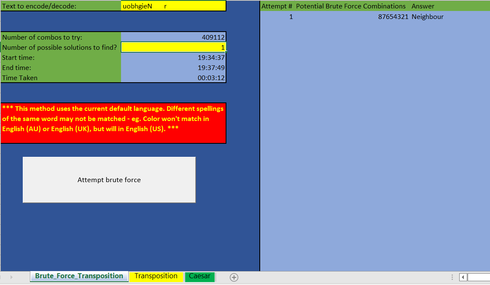

### Linux scripting

- I have long held the belief that the keyboard is superior to the mouse, and I have had significant experience with coding in VBA for Excel, so when we were required to write some scripts for our homework and an in-class activity, I decided to add some extra features above what was required for the class. One of our homework assignments required us to extract some information from some files based on time and time/game played. [roulette_dealer_finder_by_time.sh](./Linux/roulette_dealer_finder_by_time.sh) and [roulette_dealer_finder_by_time_and_game.sh](./Linux/roulette_dealer_finder_by_time_and_game.sh) were written to provide additional information to the user and assistance in running the scripts correctly should they enter incorrect syntax.
- A class activity bonus section required a loop script to run an nslookup with types `A`, `NS` and `mx` respectively. I created the [loop script](./Linux/Loop_nsl.sh) and added some extra formatting and headers in to make the output easier to read.

### Web Development
During the week 14 topic of web development, we learnt about:
-  HTTP with Sessions and Cookies
    - Understand HTTP requests and responses. 
    - Use the `curl` command-line tool to make GET and POST requests and examine the responses.
    - Manage cookies using Chrome extensions and `curl`.
    - Use Chrome's Developer Tools to audit HTTP request and response headers.

- Microservices and Web Application Architecture

  - Understand how microservices and architecture work to deliver more robust, reliable, and repeatable infrastructure as code.
  - Define the different services within a LEMP stack.
  - Deploy a Docker Compose container set and test the deployment's functionality.
  - Describe how relational databases store and retrieve data.
  - Create SQL queries to view, enter, and delete data

The knowledge base developed during this topic can be found [here](/Knowledge-base/wk-14-Web-Development.md).

### Web Vulnerabilities and Hardening
During the week 15 topic of web vulnerabilities and hardening, we learnt about:
- Articulate the intended and unintended functionalities of a web application.

- Identify and differentiate between SQL and XSS injection vulnerabilities.

- Design malicious SQL queries using DB Fiddle. 

- Create payloads from the malicious SQL queries to test for SQL injection against a web application.

- Design malicious payloads to test for stored and reflected cross-site scripting vulnerabilities.

- Differentiate between front-end and back-end component vulnerabilities.

- View confidential files with a directory traversal attack by using the dot-slash method.

- Exploit a web application's file upload functionality to conduct a local file inclusion attack.

- Modify a web application's URL to use a malicious remote script to conduct three different remote file inclusion attacks.

- Identify ways in which web application security tools can assist with testing security vulnerabilities.

- Configure Burp Suite and Foxy Proxy to capture and analyze an HTTP request.

- Identify session management vulnerabilities using the Burp Suite Repeater function.

- Conduct a brute force attack against a web application login page with the Burp Intruder function.

The knowledge base developed during this topic can be found [here](/Knowledge-base/wk-15-Web-Vulnerabilities-and-Hardening.md).

### Penetration Testing
During the week 16 topic of penetration testing, we learnt about:
- Introduction to Pen Testing and Open Source Intelligence
- An introduction to pen testing and its business goals.
- A high-level overview of the various stages of a pentest engagement.
- Network Discovery and Vulnerability Scanning
- Perform network enumeration using Nmap.
- Properly use Nmap options.
- Explain what the Nmap Scripting Engine (NSE) is and how it's used.
- Run scripted Shellshock exploits.
- Consult the Exploit-DB database to research publicly disclosed exploits.
- Search for exploits and shellcode using SearchSploit.

The knowledge base developed during this topic can be found [here](/Knowledge-base/wk-16-Penetration-Testing.md).

### Penetration Testing II
During the week 17 topic of penetration testing II, we learnt about:
- Use Metasploit to assist in various stages of a penetration test. 
- Use SearchSploit to determine if the targets are vulnerable to exploits. 
- Use exploit modules from the Metasploit framework to establish a reverse shell on a target.
- Post Exploitation with Meterpreter 
- Establish bind and reverse shells using Ncat.
- Set Meterpreter payloads on a target.
- Use Meterpreter shells to exfiltrate data from the target machine.
- Custom Payloads with msfvenom
- Create custom payloads.
- Add payloads to websites by altering HTML. 
- Assess overall penetration test engagement skills.

The knowledge base developed during this topic can be found [here](/Knowledge-base/wk-17-Penetration-Testing-II-recommendations.md)

### SIEMS
During the week 18 topic of SIEMS, we learnt about:
  - Analyse logs and determine the types of data they contain, as well as the types of security events they can help identify.  
  - Isolate, identify, and correlate fields across raw log files.  
  - Design a correlation rule that triggers a notification when an event occurs.  
  - Make informed decisions about which SIEM vendor is best for an organization.  
- Splunk Searches
  - Explore and select Splunk add-ons and apps based on project needs.
  - Upload logs into a Splunk repository.
  - Write complex SPL queries to analyze specific security situations.
- Splunk Reports and Alerts
  - Use SPL commands `stat` and `eval` to create new fields in Splunk.
  - Schedule statistical reports in Splunk.
  - Determine baselines of normal activity in order to trigger alerts.
  - Design and schedule alerts to notify if an attack is occurring.

The knowledge base developed during this topic can be found [here](/Knowledge-base/wk-18-SIEMs.md)
